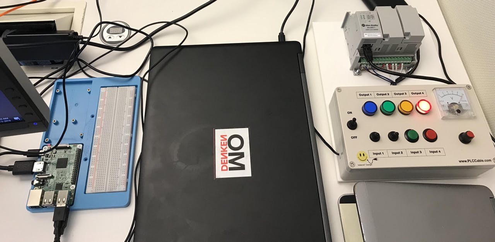
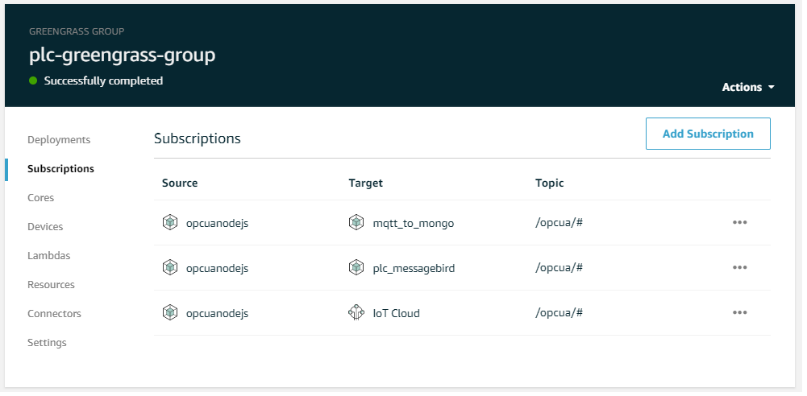

After finishing my PoC of AWS Greengrass with PLC i was curious if i could use it with a local database, i choosed mongoDB.

*My PoC with AWS Greengrass and a PLC: https://www.hackster.io/mariopoeta/allen-bradley-plc-aws-iot-poc-7ef061*

You will need to create another subescription in greengrass and you are done

*if you are curious about the plc_messagebird lambda, check: https://www.hackster.io/mariopoeta/sms-from-plc-with-aws-iot-and-messagebird-sms-api-67b4fb*