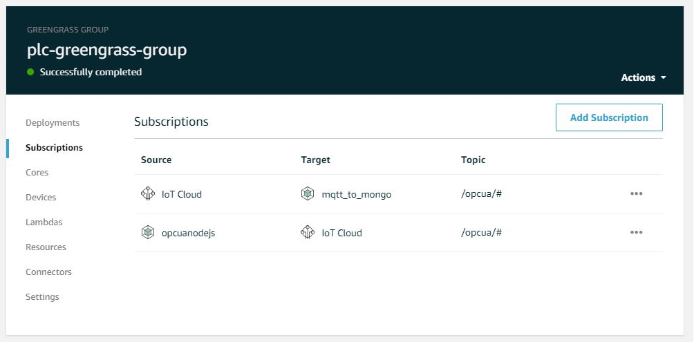

* After finishing my PoC with AWS Greengrass with PLC i was cuirous if i could use it with a local database, i choosed mongoDB. *

My PoC with AWS Greengrass and a PLC: https://www.hackster.io/mariopoeta/allen-bradley-plc-aws-iot-poc-7ef061

*You will need to create another subescription in greengrass and you are done*

